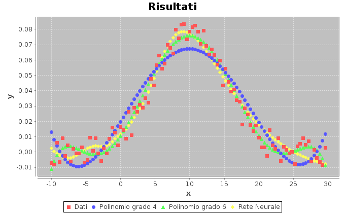

#Fit data with Neural Net



This project works thanks to [@deeplearning4J](https://github.com/deeplearning4j/deeplearning4j) libraries.
#Configuration
```
MultiLayerConfiguration conf = new NeuralNetConfiguration.Builder()
				.seed(seed)
				.iterations(iterations)
				.optimizationAlgo(OptimizationAlgorithm.STOCHASTIC_GRADIENT_DESCENT) //how to evaluate the error
				.learningRate(learningRate)
				.weightInit(WeightInit.XAVIER)
				.updater(Updater.NESTEROVS).momentum(0.9)
				.list()
				.layer(0, new DenseLayer.Builder().nIn(numInputs).nOut(numHiddenNodes)
						.activation("identity")
						.build())
				.layer(1, new DenseLayer.Builder().nIn(numHiddenNodes).nOut(numHiddenNodes)
						.activation("tanh")
						.build())
				.layer(2, new OutputLayer.Builder(LossFunctions.LossFunction.MSE)	//MeanSquare set (Y-yobs)^2 minimum
						.activation("identity")
						.nIn(numHiddenNodes).nOut(numOutputs).build())
				.pretrain(false).backprop(true).build();

		MultiLayerNetwork net=new  MultiLayerNetwork(conf);
```

#License
See [LICENSE](LICENSE)
